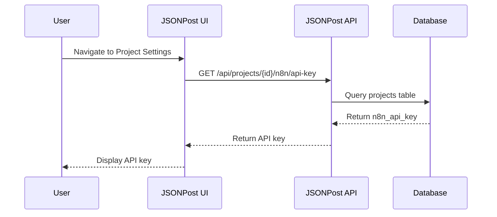
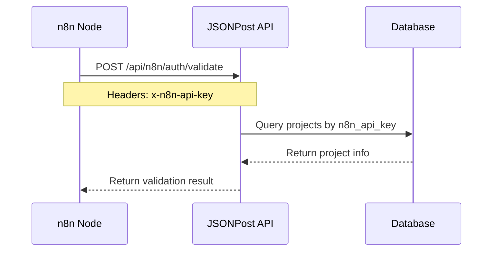
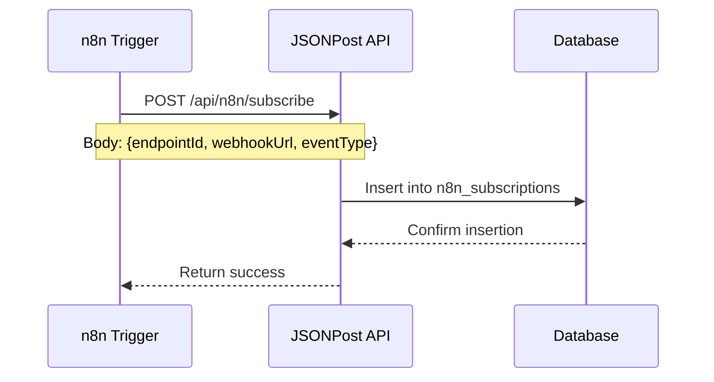
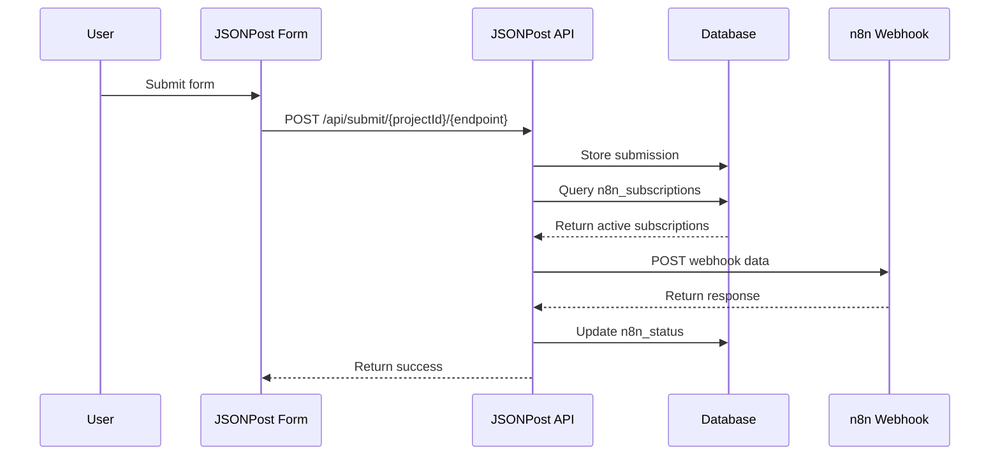

# JSONPost n8n Integration Documentation

## Overview

This document provides comprehensive documentation for the n8n integration implemented in JSONPost, including detailed instructions for creating a custom n8n node that connects to the JSONPost API.

## Table of Contents

1. [Integration Architecture](#integration-architecture)
2. [Backend Implementation](#backend-implementation)
3. [Database Schema](#database-schema)
4. [API Endpoints](#api-endpoints)
5. [n8n Node Development Guide](#n8n-node-development-guide)
6. [Authentication Flow](#authentication-flow)
7. [Webhook Management](#webhook-management)
8. [Testing and Deployment](#testing-and-deployment)

## Integration Architecture

### High-Level Architecture

```
┌─────────────────┐    ┌─────────────────┐    ┌─────────────────┐
│   JSONPost      │    │   n8n Node      │    │   n8n Server    │
│   Application   │◄──►│   (Custom)      │◄──►│   Instance      │
└─────────────────┘    └─────────────────┘    └─────────────────┘
         │                       │                       │
         │                       │                       │
         ▼                       ▼                       ▼
┌─────────────────┐    ┌─────────────────┐    ┌─────────────────┐
│   Database      │    │   API Calls     │    │   Workflow      │
│   (Supabase)    │    │   & Webhooks    │    │   Execution     │
└─────────────────┘    └─────────────────┘    └─────────────────┘
```

### Component Interaction Flow

1. **User Setup**: User generates n8n API key in JSONPost dashboard
2. **Node Configuration**: User configures n8n node with API key and selects endpoints
3. **Webhook Registration**: n8n node registers webhook URLs with JSONPost
4. **Form Submission**: When forms are submitted, JSONPost sends data to registered webhooks
5. **Workflow Execution**: n8n receives webhook data and executes workflow

## Backend Implementation

### File Structure

```
src/
├── app/api/
│   ├── projects/[projectId]/n8n/
│   │   ├── api-key/
│   │   │   ├── route.ts                    # GET API key
│   │   │   └── regenerate/
│   │   │       └── route.ts                # POST regenerate key
│   └── n8n/
│       ├── auth/
│       │   └── validate/
│       │       └── route.ts                # POST validate API key
│       ├── projects/
│       │   └── endpoints/
│       │       └── route.ts                # GET project endpoints
│       ├── subscribe/
│       │   └── route.ts                    # POST webhook subscription
│       └── unsubscribe/
│           └── route.ts                    # DELETE webhook subscription
├── components/dashboard/project-settings.tsx  # UI for n8n integration
├── lib/database.types.ts                      # Updated with n8n types
└── middleware.ts                              # Updated with n8n routes
```

### Key Implementation Details

#### 1. API Key Management
- Each project gets a unique n8n API key stored in `projects.n8n_api_key`
- Keys are generated using `crypto.randomBytes(32).toString('hex')`
- Keys can be regenerated while maintaining existing subscriptions

#### 2. Webhook Subscription Management
- Subscriptions stored in `n8n_subscriptions` table
- Each subscription links a project endpoint to an n8n webhook URL
- Supports activation/deactivation without deletion

#### 3. Form Submission Integration
- Integrated into existing form submission handler
- Sends data to all active n8n subscriptions for the endpoint
- Includes comprehensive error handling and status tracking

## Database Schema

### New Tables

#### `n8n_subscriptions`
```sql
CREATE TABLE n8n_subscriptions (
  id UUID PRIMARY KEY DEFAULT gen_random_uuid(),
  project_id UUID NOT NULL REFERENCES projects(id) ON DELETE CASCADE,
  endpoint_id UUID NOT NULL REFERENCES endpoints(id) ON DELETE CASCADE,
  target_url TEXT NOT NULL,
  event_type TEXT NOT NULL DEFAULT 'form_submission',
  is_active BOOLEAN NOT NULL DEFAULT true,
  created_at TIMESTAMP WITH TIME ZONE DEFAULT NOW(),
  updated_at TIMESTAMP WITH TIME ZONE DEFAULT NOW()
);
```

### Modified Tables

#### `projects` - Added n8n API key
```sql
ALTER TABLE projects ADD COLUMN n8n_api_key TEXT;
```

#### `submissions` - Added n8n status tracking
```sql
ALTER TABLE submissions ADD COLUMN n8n_status TEXT;
```

## API Endpoints

### Authentication Required Endpoints

#### `GET /api/projects/[projectId]/n8n/api-key`
**Purpose**: Retrieve n8n API key for a project
**Authentication**: User must own the project
**Response**:
```json
{
  "apiKey": "64-character-hex-string"
}
```

#### `POST /api/projects/[projectId]/n8n/api-key/regenerate`
**Purpose**: Generate new n8n API key
**Authentication**: User must own the project
**Response**:
```json
{
  "apiKey": "new-64-character-hex-string"
}
```

### Public n8n API Endpoints

#### `POST /api/n8n/auth/validate`
**Purpose**: Validate n8n API key and return project info
**Headers**: `x-n8n-api-key: your-api-key`
**Response**:
```json
{
  "valid": true,
  "project": {
    "id": "uuid",
    "name": "Project Name"
  }
}
```

#### `GET /api/n8n/projects/endpoints`
**Purpose**: Get available endpoints for project
**Headers**: `x-n8n-api-key: your-api-key`
**Response**:
```json
{
  "endpoints": [
    {
      "id": "uuid",
      "name": "Contact Form",
      "path": "contact"
    }
  ]
}
```

#### `POST /api/n8n/subscribe`
**Purpose**: Subscribe to webhook notifications
**Headers**: `x-n8n-api-key: your-api-key`
**Body**:
```json
{
  "endpointId": "uuid",
  "webhookUrl": "https://n8n.instance.com/webhook/uuid",
  "eventType": "form_submission"
}
```

#### `DELETE /api/n8n/unsubscribe`
**Purpose**: Unsubscribe from webhook notifications
**Headers**: `x-n8n-api-key: your-api-key`
**Body**:
```json
{
  "endpointId": "uuid",
  "webhookUrl": "https://n8n.instance.com/webhook/uuid"
}
```

## n8n Node Development Guide

### Project Setup

#### 1. Create New n8n Node Project

```bash
# Create new directory
mkdir n8n-nodes-jsonpost
cd n8n-nodes-jsonpost

# Initialize npm project
npm init -y

# Install n8n node development dependencies
npm install --save-dev @types/node typescript ts-node nodemon
npm install n8n-workflow n8n-core
```

#### 2. Project Structure

```
n8n-nodes-jsonpost/
├── package.json
├── tsconfig.json
├── nodes/
│   └── JsonPost/
│       ├── JsonPost.node.ts           # Main node implementation
│       ├── JsonPostTrigger.node.ts    # Webhook trigger node
│       └── descriptions/
│           ├── JsonPostDescription.ts  # Node properties
│           └── TriggerDescription.ts   # Trigger properties
├── credentials/
│   └── JsonPostApi.credentials.ts     # API credentials
└── dist/                              # Compiled output
```

### Node Implementation

#### 1. Credentials File (`credentials/JsonPostApi.credentials.ts`)

```typescript
import {
  ICredentialType,
  INodeProperties,
} from 'n8n-workflow';

export class JsonPostApi implements ICredentialType {
  name = 'jsonPostApi';
  displayName = 'JSONPost API';
  documentationUrl = 'https://jsonpost.io/docs/n8n-integration';
  
  properties: INodeProperties[] = [
    {
      displayName: 'API Key',
      name: 'apiKey',
      type: 'string',
      typeOptions: {
        password: true,
      },
      default: '',
      required: true,
      description: 'Your JSONPost n8n API key from project settings',
    },
    {
      displayName: 'Base URL',
      name: 'baseUrl',
      type: 'string',
      default: 'https://jsonpost.io',
      required: true,
      description: 'JSONPost base URL (use https://jsonpost.io for production)',
    },
  ];
}
```

#### 2. Main Node (`nodes/JsonPost/JsonPost.node.ts`)

```typescript
import {
  IExecuteFunctions,
  INodeExecutionData,
  INodeType,
  INodeTypeDescription,
  NodeOperationError,
} from 'n8n-workflow';

export class JsonPost implements INodeType {
  description: INodeTypeDescription = {
    displayName: 'JSONPost',
    name: 'jsonPost',
    icon: 'file:jsonpost.svg',
    group: ['transform'],
    version: 1,
    subtitle: '={{$parameter["operation"]}}',
    description: 'Interact with JSONPost form endpoints',
    defaults: {
      name: 'JSONPost',
    },
    inputs: ['main'],
    outputs: ['main'],
    credentials: [
      {
        name: 'jsonPostApi',
        required: true,
      },
    ],
    properties: [
      {
        displayName: 'Operation',
        name: 'operation',
        type: 'options',
        noDataExpression: true,
        options: [
          {
            name: 'Get Endpoints',
            value: 'getEndpoints',
            description: 'Get all available form endpoints',
            action: 'Get all available form endpoints',
          },
          {
            name: 'Subscribe to Webhook',
            value: 'subscribe',
            description: 'Subscribe to form submission webhooks',
            action: 'Subscribe to form submission webhooks',
          },
          {
            name: 'Unsubscribe from Webhook',
            value: 'unsubscribe',
            description: 'Unsubscribe from form submission webhooks',
            action: 'Unsubscribe from form submission webhooks',
          },
        ],
        default: 'getEndpoints',
      },
      {
        displayName: 'Endpoint',
        name: 'endpointId',
        type: 'options',
        typeOptions: {
          loadOptionsMethod: 'getEndpoints',
        },
        displayOptions: {
          show: {
            operation: ['subscribe', 'unsubscribe'],
          },
        },
        default: '',
        required: true,
        description: 'The form endpoint to subscribe to',
      },
      {
        displayName: 'Webhook URL',
        name: 'webhookUrl',
        type: 'string',
        displayOptions: {
          show: {
            operation: ['subscribe', 'unsubscribe'],
          },
        },
        default: '',
        required: true,
        description: 'The webhook URL to receive form submissions',
      },
    ],
  };

  methods = {
    loadOptions: {
      async getEndpoints(this: IExecuteFunctions) {
        const credentials = await this.getCredentials('jsonPostApi');
        const baseUrl = credentials.baseUrl as string;
        const apiKey = credentials.apiKey as string;

        const options = {
          method: 'GET',
          url: `${baseUrl}/api/n8n/projects/endpoints`,
          headers: {
            'x-n8n-api-key': apiKey,
          },
        };

        try {
          const response = await this.helpers.request(options);
          return response.endpoints.map((endpoint: any) => ({
            name: `${endpoint.name} (/${endpoint.path})`,
            value: endpoint.id,
          }));
        } catch (error) {
          throw new NodeOperationError(this.getNode(), `Failed to load endpoints: ${error.message}`);
        }
      },
    },
  };

  async execute(this: IExecuteFunctions): Promise<INodeExecutionData[][]> {
    const items = this.getInputData();
    const returnData: INodeExecutionData[] = [];
    const operation = this.getNodeParameter('operation', 0) as string;
    
    const credentials = await this.getCredentials('jsonPostApi');
    const baseUrl = credentials.baseUrl as string;
    const apiKey = credentials.apiKey as string;

    for (let i = 0; i < items.length; i++) {
      try {
        let responseData;

        if (operation === 'getEndpoints') {
          const options = {
            method: 'GET',
            url: `${baseUrl}/api/n8n/projects/endpoints`,
            headers: {
              'x-n8n-api-key': apiKey,
            },
          };
          responseData = await this.helpers.request(options);

        } else if (operation === 'subscribe') {
          const endpointId = this.getNodeParameter('endpointId', i) as string;
          const webhookUrl = this.getNodeParameter('webhookUrl', i) as string;

          const options = {
            method: 'POST',
            url: `${baseUrl}/api/n8n/subscribe`,
            headers: {
              'x-n8n-api-key': apiKey,
              'Content-Type': 'application/json',
            },
            body: {
              endpointId,
              webhookUrl,
              eventType: 'form_submission',
            },
            json: true,
          };
          responseData = await this.helpers.request(options);

        } else if (operation === 'unsubscribe') {
          const endpointId = this.getNodeParameter('endpointId', i) as string;
          const webhookUrl = this.getNodeParameter('webhookUrl', i) as string;

          const options = {
            method: 'DELETE',
            url: `${baseUrl}/api/n8n/unsubscribe`,
            headers: {
              'x-n8n-api-key': apiKey,
              'Content-Type': 'application/json',
            },
            body: {
              endpointId,
              webhookUrl,
            },
            json: true,
          };
          responseData = await this.helpers.request(options);
        }

        returnData.push({
          json: responseData,
        });

      } catch (error) {
        if (this.continueOnFail()) {
          returnData.push({
            json: {
              error: error.message,
            },
          });
          continue;
        }
        throw error;
      }
    }

    return [returnData];
  }
}
```

#### 3. Webhook Trigger Node (`nodes/JsonPost/JsonPostTrigger.node.ts`)

```typescript
import {
  IHookFunctions,
  IWebhookFunctions,
  INodeType,
  INodeTypeDescription,
  IWebhookResponseData,
  NodeOperationError,
} from 'n8n-workflow';

export class JsonPostTrigger implements INodeType {
  description: INodeTypeDescription = {
    displayName: 'JSONPost Trigger',
    name: 'jsonPostTrigger',
    icon: 'file:jsonpost.svg',
    group: ['trigger'],
    version: 1,
    description: 'Trigger workflow on JSONPost form submissions',
    defaults: {
      name: 'JSONPost Trigger',
    },
    inputs: [],
    outputs: ['main'],
    credentials: [
      {
        name: 'jsonPostApi',
        required: true,
      },
    ],
    webhooks: [
      {
        name: 'default',
        httpMethod: 'POST',
        responseMode: 'onReceived',
        path: 'webhook',
      },
    ],
    properties: [
      {
        displayName: 'Form Endpoint',
        name: 'endpointId',
        type: 'options',
        typeOptions: {
          loadOptionsMethod: 'getEndpoints',
        },
        default: '',
        required: true,
        description: 'The form endpoint to listen for submissions',
      },
    ],
  };

  methods = {
    loadOptions: {
      async getEndpoints(this: IHookFunctions) {
        const credentials = await this.getCredentials('jsonPostApi');
        const baseUrl = credentials.baseUrl as string;
        const apiKey = credentials.apiKey as string;

        const options = {
          method: 'GET',
          url: `${baseUrl}/api/n8n/projects/endpoints`,
          headers: {
            'x-n8n-api-key': apiKey,
          },
        };

        try {
          const response = await this.helpers.request(options);
          return response.endpoints.map((endpoint: any) => ({
            name: `${endpoint.name} (/${endpoint.path})`,
            value: endpoint.id,
          }));
        } catch (error) {
          throw new NodeOperationError(this.getNode(), `Failed to load endpoints: ${error.message}`);
        }
      },
    },
  };

  // Webhook lifecycle methods
  async webhookMethods() {
    return {
      default: {
        async checkExists(this: IHookFunctions): Promise<boolean> {
          // Check if webhook subscription exists
          const webhookUrl = this.getNodeWebhookUrl('default');
          const endpointId = this.getNodeParameter('endpointId') as string;
          
          // Implementation to check if subscription exists
          // Return true if exists, false otherwise
          return false;
        },

        async create(this: IHookFunctions): Promise<boolean> {
          const webhookUrl = this.getNodeWebhookUrl('default');
          const endpointId = this.getNodeParameter('endpointId') as string;
          const credentials = await this.getCredentials('jsonPostApi');
          const baseUrl = credentials.baseUrl as string;
          const apiKey = credentials.apiKey as string;

          const options = {
            method: 'POST',
            url: `${baseUrl}/api/n8n/subscribe`,
            headers: {
              'x-n8n-api-key': apiKey,
              'Content-Type': 'application/json',
            },
            body: {
              endpointId,
              webhookUrl,
              eventType: 'form_submission',
            },
            json: true,
          };

          try {
            await this.helpers.request(options);
            return true;
          } catch (error) {
            throw new NodeOperationError(this.getNode(), `Failed to create webhook: ${error.message}`);
          }
        },

        async delete(this: IHookFunctions): Promise<boolean> {
          const webhookUrl = this.getNodeWebhookUrl('default');
          const endpointId = this.getNodeParameter('endpointId') as string;
          const credentials = await this.getCredentials('jsonPostApi');
          const baseUrl = credentials.baseUrl as string;
          const apiKey = credentials.apiKey as string;

          const options = {
            method: 'DELETE',
            url: `${baseUrl}/api/n8n/unsubscribe`,
            headers: {
              'x-n8n-api-key': apiKey,
              'Content-Type': 'application/json',
            },
            body: {
              endpointId,
              webhookUrl,
            },
            json: true,
          };

          try {
            await this.helpers.request(options);
            return true;
          } catch (error) {
            throw new NodeOperationError(this.getNode(), `Failed to delete webhook: ${error.message}`);
          }
        },
      },
    };
  }

  async webhook(this: IWebhookFunctions): Promise<IWebhookResponseData> {
    const bodyData = this.getBodyData();
    
    return {
      workflowData: [
        [
          {
            json: bodyData,
          },
        ],
      ],
    };
  }
}
```

### Package Configuration

#### `package.json`

```json
{
  "name": "n8n-nodes-jsonpost",
  "version": "1.0.0",
  "description": "n8n node for JSONPost form handling",
  "keywords": ["n8n-community-node-package"],
  "license": "MIT",
  "homepage": "https://jsonpost.io",
  "author": {
    "name": "JSONPost",
    "email": "support@jsonpost.io"
  },
  "repository": {
    "type": "git",
    "url": "https://github.com/jsonpost/n8n-nodes-jsonpost.git"
  },
  "main": "index.js",
  "scripts": {
    "build": "tsc && gulp build:icons",
    "dev": "tsc --watch",
    "format": "prettier nodes credentials --write",
    "lint": "eslint nodes credentials package.json",
    "lintfix": "eslint nodes credentials package.json --fix",
    "prepublishOnly": "npm run build && npm run lint -s"
  },
  "files": [
    "dist"
  ],
  "n8n": {
    "n8nNodesApiVersion": 1,
    "credentials": [
      "dist/credentials/JsonPostApi.credentials.js"
    ],
    "nodes": [
      "dist/nodes/JsonPost/JsonPost.node.js",
      "dist/nodes/JsonPost/JsonPostTrigger.node.js"
    ]
  },
  "devDependencies": {
    "@types/node": "^18.16.16",
    "typescript": "^5.1.3",
    "prettier": "^2.7.1",
    "eslint": "^8.42.0"
  },
  "dependencies": {
    "n8n-workflow": "^1.0.0",
    "n8n-core": "^1.0.0"
  }
}
```

#### `tsconfig.json`

```json
{
  "compilerOptions": {
    "target": "es2019",
    "module": "commonjs",
    "lib": ["es2019"],
    "declaration": true,
    "outDir": "./dist",
    "rootDir": "./",
    "strict": true,
    "noUnusedLocals": true,
    "noUnusedParameters": true,
    "noImplicitReturns": true,
    "noFallthroughCasesInSwitch": true,
    "moduleResolution": "node",
    "allowSyntheticDefaultImports": true,
    "esModuleInterop": true,
    "experimentalDecorators": true,
    "emitDecoratorMetadata": true,
    "skipLibCheck": true,
    "forceConsistentCasingInFileNames": true
  },
  "include": [
    "credentials/**/*",
    "nodes/**/*"
  ],
  "exclude": [
    "dist/**/*",
    "node_modules/**/*"
  ]
}
```

## Authentication Flow

### 1. API Key Generation


### 2. n8n Node Authentication


## Webhook Management

### Subscription Flow


### Form Submission Flow


## Testing and Deployment

### Local Development Setup

1. **JSONPost Development**:
```bash
# Start JSONPost development server
npm run dev
```

2. **n8n Node Development**:
```bash
# Build the node
npm run build

# Link for local testing
npm link

# In n8n installation directory
npm link n8n-nodes-jsonpost
```

3. **Testing with n8n**:
```bash
# Start n8n with custom nodes
N8N_CUSTOM_EXTENSIONS=n8n-nodes-jsonpost n8n start
```

### Production Deployment

1. **Publish n8n Node**:
```bash
npm publish
```

2. **Install in n8n**:
```bash
npm install n8n-nodes-jsonpost
```

### Testing Checklist

- [ ] API key generation and validation
- [ ] Endpoint listing functionality
- [ ] Webhook subscription/unsubscription
- [ ] Form submission webhook delivery
- [ ] Error handling and edge cases
- [ ] CORS configuration
- [ ] Authentication middleware
- [ ] Database constraints and relationships

## Security Considerations

1. **API Key Security**:
   - Keys are 64-character hex strings (256-bit entropy)
   - Stored securely in database
   - Can be regenerated without breaking existing workflows

2. **Webhook Validation**:
   - All webhook requests validate API keys
   - Endpoint ownership verification
   - Rate limiting on webhook endpoints

3. **CORS Configuration**:
   - Proper CORS headers for n8n integration
   - Restricted to necessary methods and headers

## Troubleshooting

### Common Issues

1. **Authentication Failures**:
   - Verify API key is correct
   - Check if key has been regenerated
   - Ensure proper headers are sent

2. **Webhook Not Receiving Data**:
   - Verify subscription is active
   - Check webhook URL accessibility
   - Review n8n_status in submissions table

3. **Endpoint Not Found**:
   - Verify endpoint exists and is active
   - Check project ownership
   - Ensure proper endpoint ID is used

### Debug Information

- Check `n8n_subscriptions` table for active subscriptions
- Review `submissions.n8n_status` for delivery status
- Monitor API logs for authentication and webhook delivery errors

## Future Enhancements

1. **Advanced Filtering**:
   - Conditional webhook delivery based on form data
   - Field-level filtering options

2. **Retry Logic**:
   - Automatic retry for failed webhook deliveries
   - Exponential backoff strategy

3. **Analytics**:
   - Webhook delivery success rates
   - Performance metrics and monitoring

4. **Batch Operations**:
   - Bulk subscription management
   - Batch webhook deliveries

This documentation provides a complete guide for implementing and maintaining the JSONPost n8n integration. The custom n8n node allows users to seamlessly integrate their JSONPost forms with n8n workflows, enabling powerful automation capabilities.