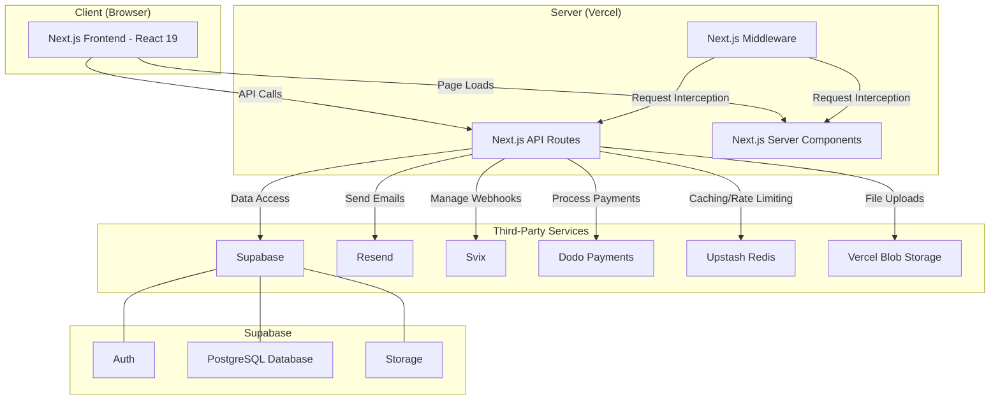

# 1. Application Architecture

This document provides a high-level overview of the technical architecture of the JSONPost application.

## Core Technologies

The application is built on a modern, serverless technology stack, primarily leveraging Next.js for both the frontend and backend, and Supabase for the database and authentication services.

-   **Framework**: [Next.js](https://nextjs.org/) (v15) with Turbopack. The application uses the App Router for routing and server-side rendering (SSR).
-   **Language**: [TypeScript](https://www.typescriptlang.org/)
-   **Database**: [Supabase](https://supabase.io/) (PostgreSQL)
-   **Authentication**: [Supabase Auth](https://supabase.io/docs/guides/auth)
-   **Styling**: [Tailwind CSS](https://tailwindcss.com/) (v4)
-   **UI Components**: [Radix UI](https://www.radix-ui.com/) and custom components.
-   **Deployment**: Vercel (implied by `next.config.ts` and general best practices for Next.js)

## Architectural Diagram

## Detailed Breakdown

### Frontend

-   **Framework**: The frontend is a [Next.js](https://nextjs.org/) 15 application using [React](https://reactjs.org/) 19.
-   **UI**: The user interface is built with [Tailwind CSS](https://tailwindcss.com/) for styling, and [Radix UI](https://www.radix-ui.com/) for accessible, unstyled components. `lucide-react` is used for icons.
-   **State Management**: The application uses a combination of React hooks and server components. `react-hook-form` is used for managing form state, particularly in the dashboard.
-   **Content**: MDX is used for content-heavy pages like the blog and documentation, as indicated by `@mdx-js/react` and `@next/mdx`.

### Backend

-   **API**: The backend is implemented using [Next.js API Routes](https://nextjs.org/docs/app/building-your-application/routing/route-handlers). This provides a serverless backend that is co-located with the frontend.
-   **Database**: A [PostgreSQL](https://www.postgresql.org/) database is provided by [Supabase](https://supabase.io/). The application interacts with it using the `supabase-js` client. The schema is defined in `schema.sql`.
-   **Authentication**: User authentication and authorization are handled by [Supabase Auth](https://supabase.io/docs/guides/auth). The `@supabase/ssr` library is used to manage authentication in server-side rendering contexts.
-   **File Storage**: File uploads are handled via `@vercel/blob`, which provides a simple way to upload and serve files from Vercel's blob storage.
-   **Caching/Rate Limiting**: `@upstash/redis` and `ioredis` suggest the use of Redis, likely for caching, rate limiting, or managing distributed state.

### Key Integrations & Services

-   **Email**: [Resend](https://resend.com/) (`resend` package) is used for sending transactional emails, such as autoresponders and notifications.
-   **Webhooks**: [Svix](https://www.svix.com/) (`svix` package) is used for reliable webhook delivery.
-   **Payments**: [Dodo Payments](https://dodopayments.com/) (`@dodopayments/nextjs` package) is used for handling billing and subscriptions.
-   **Form Validation**: [AJV](https://ajv.js.org/) (`ajv` and `ajv-formats`) is used for JSON schema validation on form submissions. [Zod](https://zod.dev/) (`zod` package) is used for schema validation, likely on the frontend with React Hook Form.
-   **Analytics**: `@vercel/analytics` is used to gather analytics about application usage.
-   **Customer Support**: `crisp-sdk-web` suggests an integration with the Crisp chat platform.

## Project Structure

The project follows a standard Next.js App Router structure:

-   `src/app/`: Contains all the application's routes.
    -   `src/app/api/`: Contains all backend API route handlers.
    -   `src/app/dashboard/`: Contains all protected routes for logged-in users.
    -   `src/app/(...)/`: Contains public-facing pages like the landing page, blog, and docs.
-   `src/components/`: Contains reusable React components.
-   `src/lib/`: Contains utility functions, Supabase client initialization, and other shared logic.
-   `src/middleware.ts`: Handles request middleware, likely for authentication and route protection.
-   `schema.sql`: Defines the database schema.
-   `form_definitions/`: Contains demo form JSON schemas.

This architecture is designed to be scalable, maintainable, and developer-friendly, leveraging the strengths of the Next.js and Supabase ecosystems.