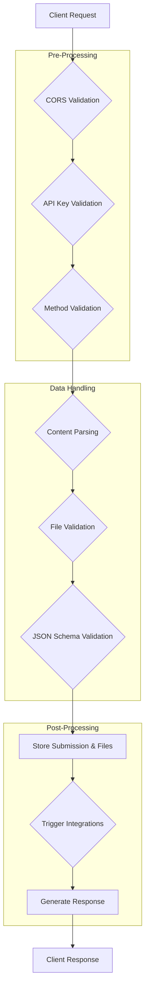

# 4. Form Submission API

This document provides a comprehensive, deep-dive analysis of the main form submission API endpoint, located at `/api/submit/[projectId]/[endpointPath]`. This endpoint is the core of the application's functionality.

## Overview

The submission API is designed to be a universal data collector. It accepts various content types, processes and validates the data, stores it, and triggers a wide range of post-submission actions like notifications and webhooks.

**Supported HTTP Methods**: `POST`, `PUT`, `PATCH`, `OPTIONS` (for CORS preflight)

## Request Processing Pipeline

The endpoint follows a strict, multi-stage pipeline to process each incoming request. A custom `SubmissionLogger` is used to trace the entire lifecycle of a submission for debugging purposes.



### 1. Endpoint Lookup & Pre-Processing

1.  **Endpoint Retrieval**: The system first queries the database to find the endpoint configuration that matches the `projectId` and `endpointPath` from the URL. If no endpoint is found, it returns a `404 Not Found` error.
2.  **CORS Validation**: The request's `Origin` header is validated against the `allowed_domains` configured for the endpoint. This check supports exact matches, `*` wildcards, and subdomain wildcards (e.g., `*.example.com`). If the origin is not allowed, a `403 Forbidden` error is returned.
3.  **API Key Validation**: If the endpoint is configured to `require_api_key`, the system checks for an `X-API-Key` header in the request and validates it against the project's API key. Missing or invalid keys result in a `401 Unauthorized` error.
4.  **Method Validation**: The request's HTTP method is checked against the method configured for the endpoint. A mismatch results in a `405 Method Not Allowed` error.

### 2. Content Parsing & Data Handling

The API is capable of parsing three main types of content:

-   **`application/json`**: The request body is parsed directly as JSON.
-   **`multipart/form-data`**: The API uses `request.formData()` to parse the submission. It intelligently separates file fields from text fields. A robust manual binary parser is included as a fallback in case the standard parser fails.
-   **`application/x-www-form-urlencoded`**: This is also handled by the `request.formData()` parser.

After initial parsing, two important transformations occur:

-   **Data Unflattening**: A helper function, `unflattenFormData`, converts flattened form data keys (e.g., `user[name]`, `items[0]`, `address.city`) into a nested JSON object structure. This is crucial for handling complex forms submitted via `multipart/form-data`.
-   **File Validation**: If files are present in the submission:
    -   It first checks if file uploads are enabled on the endpoint.
    -   The number of files is checked against `max_files_per_submission`.
    -   Each file's size is validated against `max_file_size_mb`.
    -   Each file's MIME type is validated against the `allowed_file_types` array.
    -   A failure at any of these steps results in a `400 Bad Request` error.

### 3. JSON Schema Validation

If the endpoint has `json_validation_enabled` set to `true` and contains a valid `json_schema`, the final `submissionData` object is validated against this schema using the **Ajv** library. If validation fails, the API returns a `400 Bad Request` with detailed error messages specifying which fields are invalid.

### 4. Database Operations

If all validations pass, the data is persisted to the database:

1.  **Store Submission**: A new record is inserted into the `submissions` table containing the `endpoint_id`, the `submissionData` (as a JSONB field), and metadata like the user's IP address and user agent.
2.  **Store Files**: If files were uploaded, they are first uploaded to a Supabase Storage bucket named `form-uploads`. Each file is stored under a unique path: `{projectId}/{endpointId}/{timestamp}_{randomString}.{extension}`. After a successful upload, a corresponding record is inserted into the `file_uploads` table, linking it to the submission.
3.  **Update Usage Stats**: A Supabase RPC function, `increment_monthly_submission_count`, is called to update the user's submission count for the current month, which is used for billing and analytics.

### 5. Post-Submission Integrations

After the submission is successfully stored, the API triggers a series of asynchronous integrations and notifications. A failure in any of these steps does **not** cause the initial form submission to fail.

-   **Webhooks (Svix)**: If the endpoint is configured with a Svix App ID, a structured payload is sent to Svix for reliable, managed webhook delivery.
-   **Webhooks (Direct/Legacy)**: If Svix is not used, the system falls back to sending a direct HTTP POST request to any URLs configured in the `endpoint_webhooks` table.
-   **Webhook JSON Transformation**: For both Svix and direct webhooks, a `webhook_json_transformation_template` can be applied to reshape the payload before it is sent.
-   **Email Notifications**: Emails are sent to all addresses configured in the `endpoint_emails` table. These emails contain the submission data and secure links to download any file attachments.
-   **Zapier Integration**: If active Zapier subscriptions are found for the endpoint, a specially formatted and flattened payload is sent to the Zapier webhook URL.
-   **n8n Integration**: Similar to Zapier, if active n8n subscriptions are found, a flattened payload is sent to the n8n webhook URL.
-   **Google Sheets Integration**: If configured, the API calls a separate internal route (`/api/google-sheets/write`) to append the submission data as a new row in the user's specified Google Sheet.
-   **Autoresponder Emails**: If an autoresponder is configured, an email is sent to the address provided by the form submitter (based on the `autoresponder_recipient_field`).

### 6. Response Generation

Finally, the API generates a response to the original client.

-   **Standard Response**: For most requests (including `application/json`), it returns a `200 OK` with a JSON body:
    ```json
    {
      "success": true,
      "message": "Configured success message.",
      "submission_id": "uuid-of-the-new-submission"
    }
    ```
-   **Redirect Response**: If a `redirect_url` is configured on the endpoint, the response behavior varies:
    -   For `multipart/form-data` submissions, the API returns an HTTP `302 Found` redirect response.
    -   For all other content types (like `application/json`), the `redirect_url` is included in the JSON response body, and the client is expected to handle the redirection.
    ```json
    {
      "success": true,
      "message": "Configured success message.",
      "submission_id": "uuid-of-the-new-submission",
      "redirect_url": "https://example.com/thank-you"
    }
    ```

This comprehensive pipeline ensures that form submissions are handled securely, robustly, and with a high degree of flexibility to support a wide range of use cases.