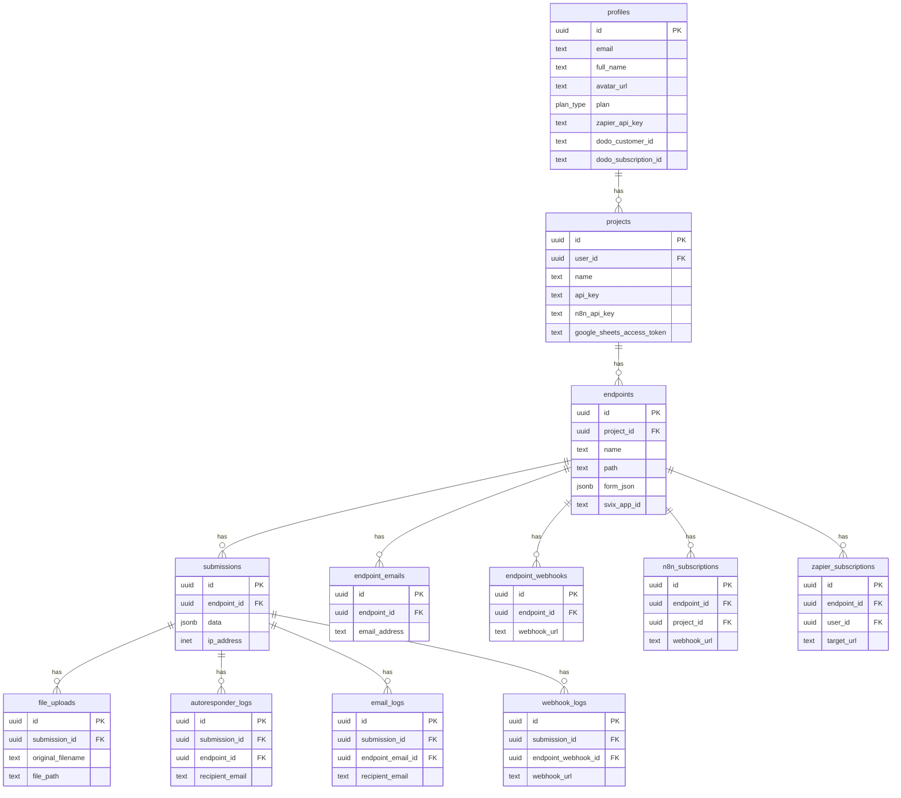

# 8. Database Schema

This document outlines the structure of the PostgreSQL database used by the JSONPost application, based on the provided `schema.sql`. The schema is designed to be relational, with clear connections between users, their projects, endpoints, and submissions.

## Schema Diagram

## Table Descriptions

### Core Tables

-   **`profiles`**: Extends the `auth.users` table from Supabase Auth. It stores user-specific information that is not directly related to authentication, such as their current subscription plan (`plan`), Dodo Payments customer and subscription IDs, and the API key for the Zapier integration.
    -   **Primary Key**: `id` (references `auth.users.id`)

-   **`projects`**: Represents a user's project. Each project acts as a container for multiple endpoints. It stores the project's name, description, and API keys for various integrations (generic `api_key`, `n8n_api_key`, and Google Sheets tokens).
    -   **Foreign Key**: `user_id` -> `profiles.id`

-   **`endpoints`**: The core of the application. This table stores the configuration for each individual form endpoint. It contains a large number of columns to handle all the different settings, including its `path`, allowed `method`, CORS settings (`allowed_domains`), email notification settings, webhook configurations (`svix_app_id`), file upload rules, and the JSON schema for validation (`json_schema`). It also stores the JSON definition for forms created with the Form Builder (`form_json`).
    -   **Foreign Key**: `project_id` -> `projects.id`

-   **`submissions`**: Stores every form submission received by an endpoint. The actual submitted data is stored in a flexible `jsonb` column named `data`. This table also logs metadata about the submission, such as the `ip_address` and `user_agent` of the sender.
    -   **Foreign Key**: `endpoint_id` -> `endpoints.id`

-   **`file_uploads`**: Contains metadata for every file uploaded with a submission. It stores the file's original name, its stored path in Supabase Storage, its size, and its MIME type.
    -   **Foreign Key**: `submission_id` -> `submissions.id`

### Integration & Logging Tables

-   **`endpoint_emails`**: A one-to-many table linking an endpoint to multiple email addresses for notifications.
-   **`endpoint_webhooks`**: A one-to-many table for the legacy direct webhook system, linking an endpoint to multiple webhook URLs.
-   **`n8n_subscriptions`** and **`zapier_subscriptions`**: These tables store the webhook subscriptions created by the n8n and Zapier integrations, respectively. They link an endpoint to a specific webhook URL provided by the automation platform.
-   **`autoresponder_logs`**, **`email_logs`**, **`webhook_logs`**: These tables log the delivery status of all post-submission actions. They record whether an email/webhook was sent successfully or failed, and store any error messages, which is crucial for debugging.
-   **`short_links`**: Stores the configuration for short links created for forms via the Form Builder.
-   **`monthly_submission_counts`**: Used for analytics and billing. It tracks the total number of submissions a user has received in a given month to enforce plan limits.

This schema is well-structured for data isolation and scalability, with clear foreign key relationships ensuring data integrity. The use of `jsonb` for submission data and form definitions provides a high degree of flexibility.