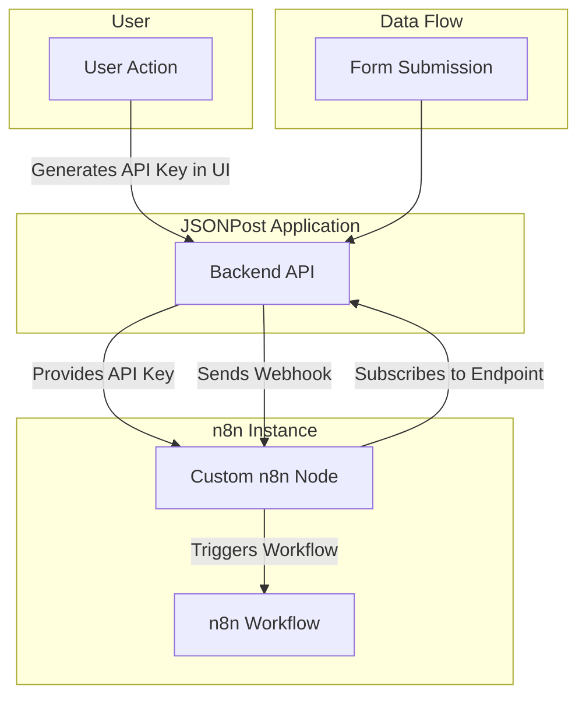
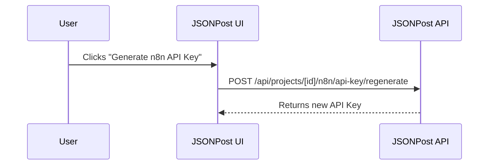
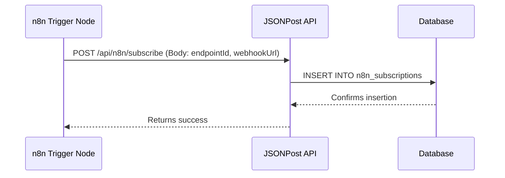
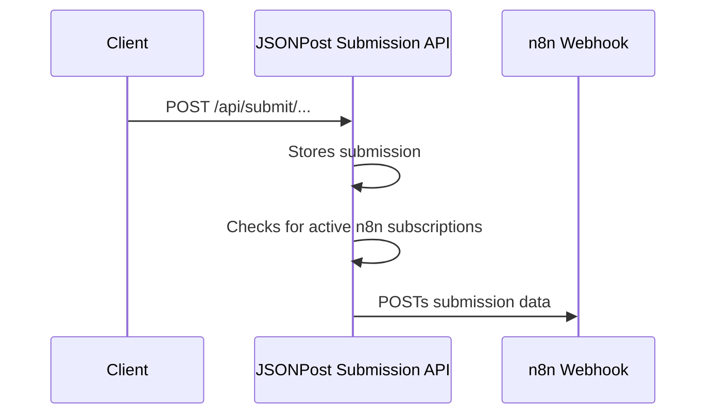

# n8n Integration

## Overview

This document provides comprehensive documentation for the n8n integration implemented in JSONPost, including detailed instructions for creating a custom n8n node that connects to the JSONPost API.

## Table of Contents

1. [Integration Architecture](#integration-architecture)
2. [Backend Implementation](#backend-implementation)
3. [Database Schema](#database-schema)
4. [API Endpoints](#api-endpoints)
5. [n8n Node Development Guide](#n8n-node-development-guide)
6. [Authentication Flow](#authentication-flow)
7. [Webhook Management](#webhook-management)
8. [Testing and Deployment](#testing-and-deployment)

## Integration Architecture

### High-Level Architecture



### Component Interaction Flow

1. **User Setup**: A user generates a unique n8n API key from their project settings page in the JSONPost dashboard.
2. **Node Configuration**: The user installs the custom JSONPost node in their n8n instance and configures it with the generated API key.
3. **Webhook Registration**: Within their n8n workflow, the user uses the JSONPost trigger node. This node automatically calls the JSONPost API to register a webhook URL, subscribing a specific form endpoint to that workflow.
4. **Form Submission**: When a form is submitted to the subscribed endpoint, the main submission handler in JSONPost sends the data to the registered n8n webhook URL.
5. **Workflow Execution**: n8n receives the webhook data and executes the corresponding workflow, allowing the user to process the submission data in any way they choose.

## Backend Implementation

### File Structure

The backend logic for the n8n integration is organized as follows:
```
src/app/api/
├── projects/[projectId]/n8n/
│   ├── api-key/
│   │   ├── route.ts                    # GET API key
│   │   └── regenerate/
│   │       └── route.ts                # POST regenerate key
└── n8n/
    ├── auth/
    │   └── validate/
    │       └── route.ts                # POST validate API key
    ├── projects/
    │   └── endpoints/
    │       └── route.ts                # GET project endpoints
    ├── subscribe/
    │   └── route.ts                    # POST webhook subscription
    └── unsubscribe/
        └── route.ts                    # DELETE webhook subscription
```

### Key Implementation Details

- **API Key Management**: Each project has a unique, cryptographically secure n8n API key stored in the `projects.n8n_api_key` column.
- **Webhook Subscriptions**: Subscriptions are managed in the `n8n_subscriptions` table, linking a project endpoint to an n8n webhook URL.
- **Form Submission Integration**: The integration is hooked into the main form submission pipeline, which checks for active n8n subscriptions for the given endpoint and sends the data accordingly.

## Database Schema

### New Table: `n8n_subscriptions`

```sql
CREATE TABLE n8n_subscriptions (
  id UUID PRIMARY KEY DEFAULT gen_random_uuid(),
  project_id UUID NOT NULL REFERENCES projects(id) ON DELETE CASCADE,
  endpoint_id UUID NOT NULL REFERENCES endpoints(id) ON DELETE CASCADE,
  webhook_url TEXT NOT NULL,
  event_type TEXT NOT NULL DEFAULT 'form_submission',
  is_active BOOLEAN NOT NULL DEFAULT true,
  created_at TIMESTAMP WITH TIME ZONE DEFAULT NOW(),
  updated_at TIMESTAMP WITH TIME ZONE DEFAULT NOW()
);
```

### Modified Tables

- **`projects`**: An `n8n_api_key` column was added to store the API key.
- **`submissions`**: An `n8n_status` column was added to track the delivery status of n8n webhooks for a given submission.

## API Endpoints

### User-Authenticated Endpoints

These endpoints are called from the JSONPost dashboard and require a user session.

- **`GET /api/projects/[projectId]/n8n/api-key`**: Retrieves the n8n API key for a project.
- **`POST /api/projects/[projectId]/n8n/api-key/regenerate`**: Generates a new n8n API key.

### Public n8n API Endpoints

These endpoints are designed to be called by the custom n8n node and are authenticated using the `x-n8n-api-key` header.

- **`POST /api/n8n/auth/validate`**: Validates an n8n API key and returns the associated project information.
- **`GET /api/n8n/projects/endpoints`**: Gets a list of all available form endpoints for the authenticated project.
- **`POST /api/n8n/subscribe`**: Creates a new webhook subscription, linking a form endpoint to an n8n workflow.
- **`DELETE /api/n8n/unsubscribe`**: Removes a webhook subscription.

*(For detailed request/response formats, please refer to the original `N8N_INTEGRATION_DOCUMENTATION.md` file or inspect the route handlers directly.)*

## n8n Node Development Guide

The original documentation contains an extensive guide on how the custom n8n node was developed, including code for the credential type, the main operational node, and the trigger node. This section is intended for developers who wish to understand or extend the custom n8n node itself.

*(The detailed code and setup instructions are omitted here for brevity but can be found in the original source document.)*

## Authentication and Webhook Flow

### Authentication


### Webhook Subscription


### Form Submission


This deep integration provides a seamless experience for developers looking to connect their forms to powerful, custom-built workflows in n8n.